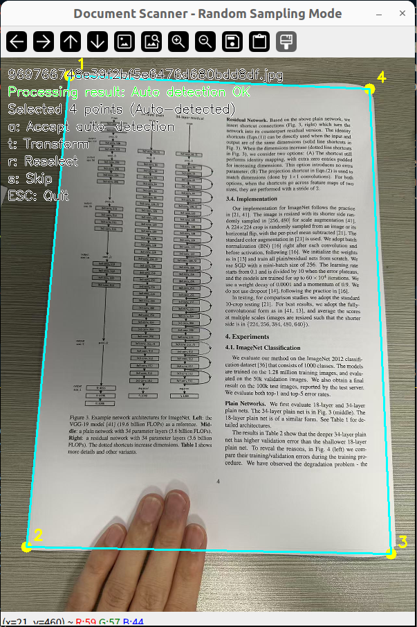
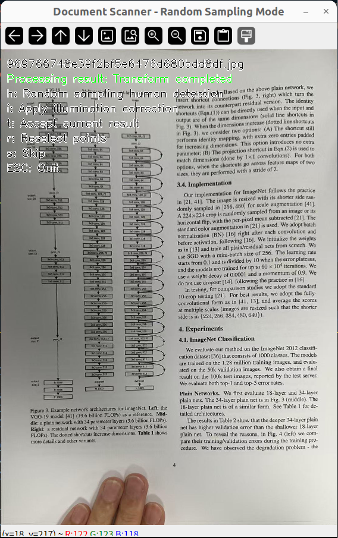
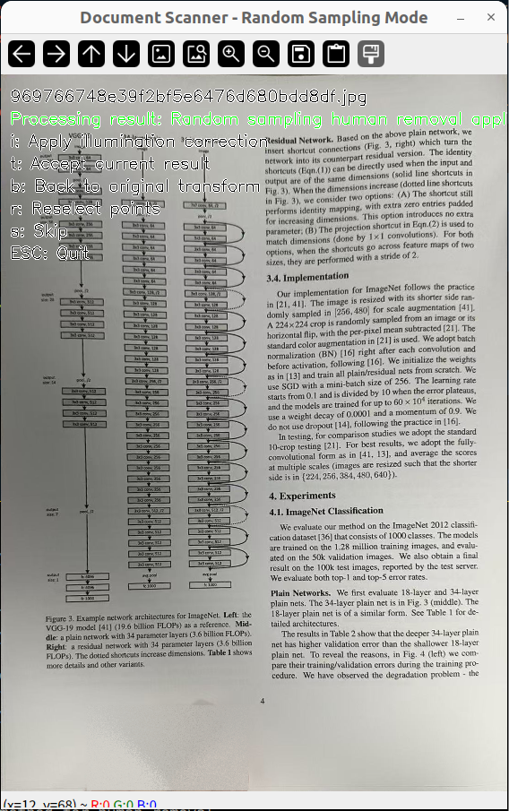
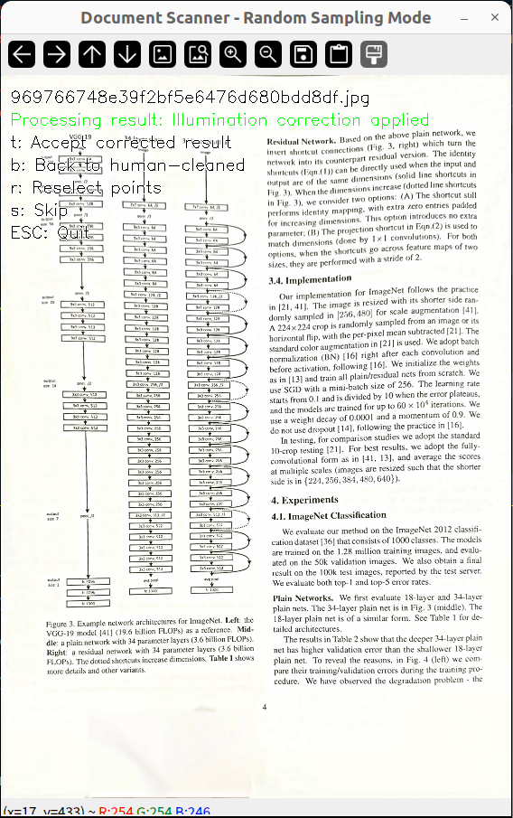

# Enhanced Document Scanner with AI Human Detection

An advanced document scanning tool that automatically detects document corners, applies perspective correction, and uses AI-powered human detection with random sampling removal for clean document digitization.

## ✨ Features

### Core Functionality
- **🔍 Automatic Corner Detection**: Intelligent contour analysis to detect document boundaries
- **📐 Perspective Correction**: Transform skewed documents to perfect rectangular format
- **🤖 AI Human Detection**: YOLO11-powered human detection and removal using advanced random sampling
- **💡 Illumination Correction**: Hybrid background subtraction and adaptive histogram equalization
- **📁 Batch Processing**: Process entire folders of images automatically
- **📄 PDF Generation**: Combine processed images into a single PDF document

### Advanced Algorithms
- **Random Sampling Fill**: Sophisticated human removal algorithm that samples surrounding pixels
- **Distance-Weighted Sampling**: Improved sampling with distance-based probability weighting
- **Edge Feathering**: Smooth mask edges using Gaussian blur and morphological operations
- **Multi-Method Fallback**: Graceful degradation when dependencies are unavailable

## 📸 Processing Examples

See the power of our document scanner in action through these step-by-step examples:

### 1. Automatic Document Detection


*Intelligent contour analysis automatically detects document boundaries and corner points, even in challenging lighting conditions.*

### 2. Perspective Transformation


*Transform skewed and angled documents into perfect rectangular format using advanced perspective correction algorithms.*

### 3. AI-Powered Human Detection & Removal


*YOLO11-powered AI detects and intelligently removes hands/fingers using sophisticated random sampling techniques that preserve document texture.*

### 4. Illumination Correction


*Advanced illumination correction using hybrid background subtraction and adaptive histogram equalization for crisp, professional results.*

## 🖼️ Processing Workflow

```
Input Image → Corner Detection → Perspective Transform → Human Detection → Illumination Correction → PDF Output
```

### Human Removal Algorithm
1. **Mask Expansion**: Expand detected human mask outward by 10 pixels as fill area
2. **Sampling Pool**: Create sampling area within 20 pixels outside the fill region
3. **Random Sampling**: Fill each pixel by randomly selecting from the sampling pool
4. **Distance Weighting**: Prioritize closer pixels for more natural results (with scipy)

## 📋 Requirements

### System Requirements
- **Python**: 3.10+ (recommended)
- **Operating System**: Windows 10+, macOS 10.15+, Ubuntu 18.04+
- **RAM**: Minimum 8GB, 16GB recommended for large batch processing

### For GPU Acceleration (Optional but Recommended)
- **NVIDIA GPU**: GTX 1060+ or RTX series
- **CUDA**: Version 11.8 or later
- **VRAM**: Minimum 4GB for YOLO11 inference

### Dependencies
All dependencies are automatically installed through the installation methods below.

## 🚀 Installation

### Using Conda (Recommended, GPU Support)

1. **Clone the repository**
```bash
git clone https://github.com/ZOMAk/enhanced-document-scanner.git
cd enhanced-document-scanner
```

2. **Create and setup conda environment**
```bash
# Create new environment with Python 3.10
conda create -n scanner python=3.10

# Activate environment
conda activate scanner

# Install PyTorch with CUDA support (for GPU acceleration)
conda install pytorch==2.0.1 torchvision==0.15.2 torchaudio==2.0.2 pytorch-cuda=11.8 -c pytorch -c nvidia

# Install OpenCV and other dependencies
conda install conda-forge::opencv
conda install conda-forge::ultralytics
```

3. **Run the scanner**
```bash
python scanner.py --folder ./images --image_size A4
```

### GPU Requirements
- **NVIDIA GPU** with CUDA 11.8+ support
- **CUDA Toolkit** 11.8 or later
- **GPU Memory**: Minimum 4GB VRAM recommended for YOLO11 inference

## 📖 Usage

### Basic Batch Processing
```bash
python scanner.py --folder ./images --image_size A4
```

### Custom Output PDF
```bash
python scanner.py --folder ./images --output_pdf ./scanned_documents.pdf
```

### Auto-Calculate Size
```bash
python scanner.py --folder ./images --image_size auto
```

### Command Line Arguments
- `--folder`: Path to folder containing images (required)
- `--image_size`: Output size format (default: A4)
- `--output_pdf`: Custom PDF output path (optional)

## 📏 Supported Output Sizes

### Predefined Formats
| Format | Resolution | DPI | Use Case |
|--------|------------|-----|----------|
| `A4` | 2480×3508 | 300 | High-quality documents |
| `A4_150` | 1240×1754 | 150 | Smaller file size |
| `A4_200` | 1654×2339 | 200 | Balanced quality/size |
| `A3` | 3508×4961 | 300 | Large documents |
| `LETTER` | 2550×3300 | 300 | US Letter format |
| `LEGAL` | 2550×4200 | 300 | US Legal format |

### Custom Sizes
```bash
# Format: width,height or widthxheight
--image_size 2000,3000
--image_size 1920x1080
```

## ⌨️ Interactive Controls

### Corner Selection Phase
- **`a`**: Accept auto-detected corner points
- **`t`**: Execute perspective transform
- **`r`**: Reselect corner points
- **`s`**: Skip current image
- **`ESC`**: Exit program

### After Perspective Transform
- **`h`**: Apply AI human detection and removal
- **`i`**: Apply illumination correction
- **`t`**: Accept current result
- **`r`**: Reselect corner points
- **`s`**: Skip current image

### Navigation
- **`b`**: Go back to previous processing step
- **`ESC`**: Exit program

## 🎯 Human Detection Capabilities

The scanner uses YOLO11 for state-of-the-art human detection:

- **Real-time Detection**: Fast processing with YOLO11n (nano) model
- **Segmentation Masks**: Precise pixel-level human detection
- **Fallback Detection**: Bounding box detection when segmentation unavailable
- **Smart Sampling**: Intelligent pixel replacement using surrounding context

### Random Sampling Algorithm Benefits
- **Natural Results**: Maintains document texture and patterns
- **No Artifacts**: Avoids the synthetic look of traditional inpainting
- **Fast Processing**: Computationally efficient compared to deep learning inpainting
- **Robust Performance**: Works well with various document types and lighting conditions

## 🔧 Technical Details

### Automatic Corner Detection
1. **Image Preprocessing**: Median blur and grayscale conversion
2. **Edge Detection**: Canny edge detection with optimized parameters
3. **Contour Analysis**: Area and perimeter filtering for document detection
4. **Polygon Approximation**: Douglas-Peucker algorithm for corner identification

### Illumination Correction Pipeline
1. **Background Subtraction**: Large-kernel Gaussian blur for illumination estimation
2. **Adaptive Histogram Equalization**: CLAHE for local contrast enhancement
3. **Noise Reduction**: Non-local means denoising for clean results

---